# Paint Overlays

Paint in-game or on the world map with colors, shapes and notes.

## Features

- Painting with a brush, text, shapes and eraser, with full color and transparency
- World map painting with the same tools
- Deeply customizable yet simple, clean UI in the sidepanel
- Pixel art stamps

## Usage

Click the sidepanel button to open the interface, then click a tool at the top to paint and press ESC or click the tool again to exit edit mode.

## Screenshots

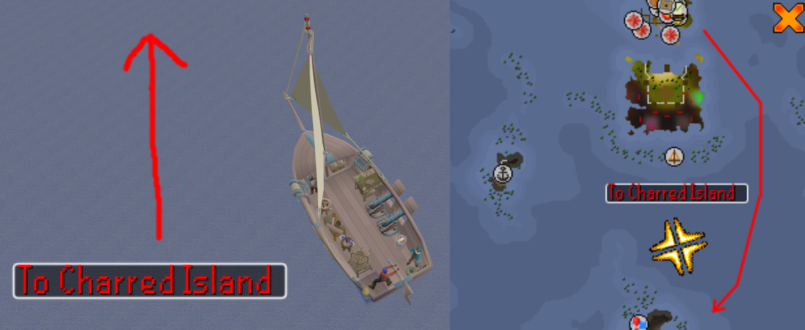

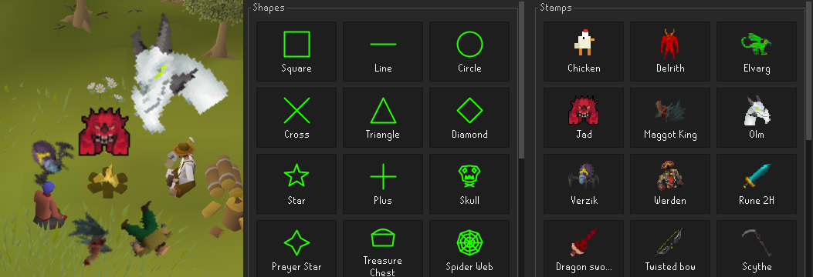

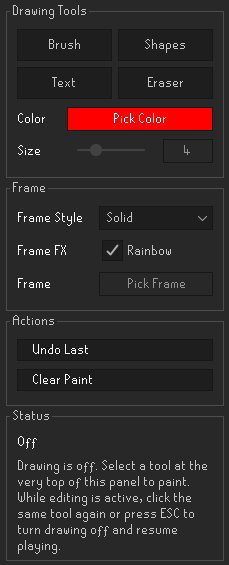

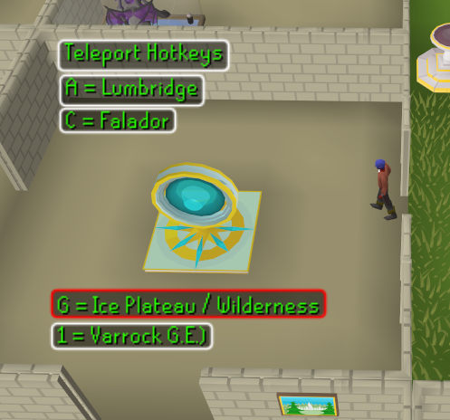

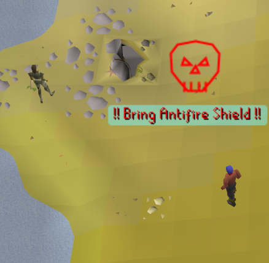

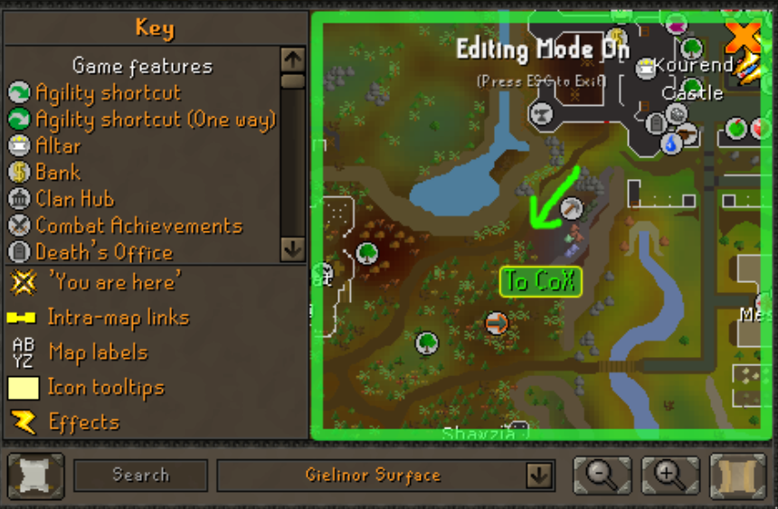

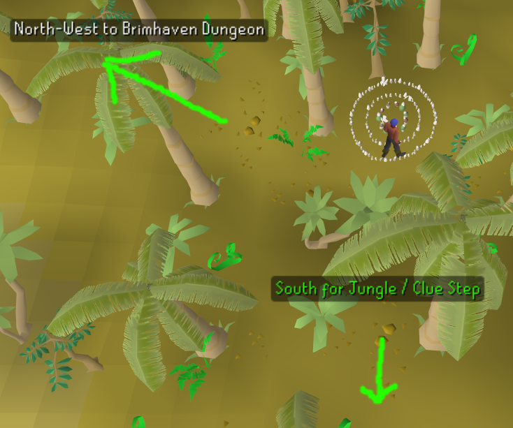

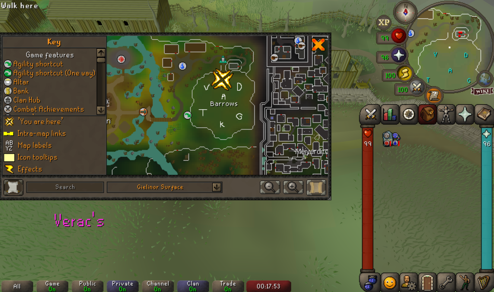

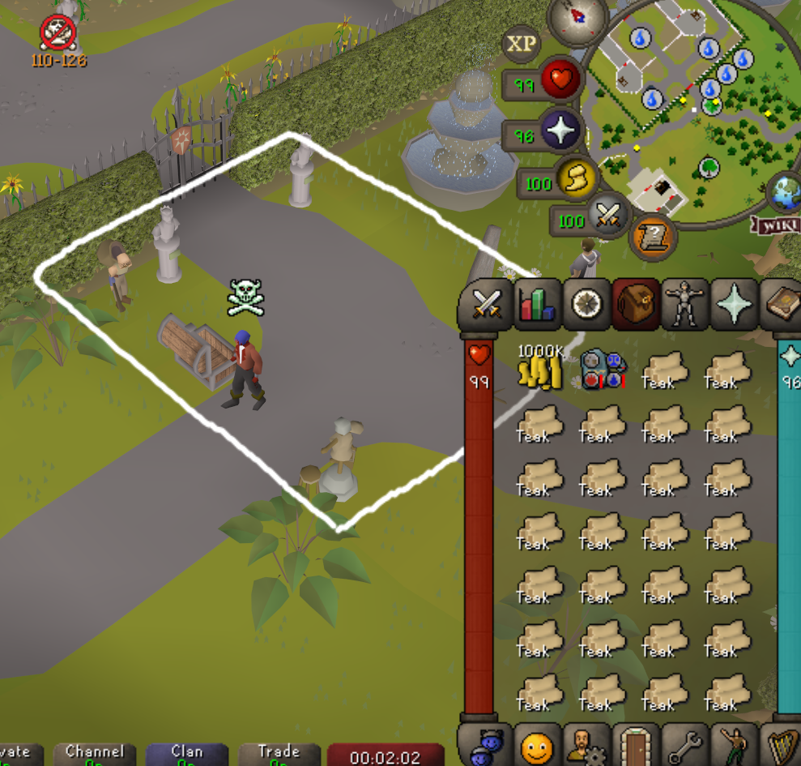

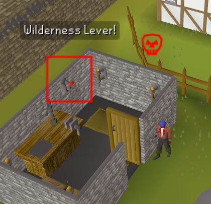

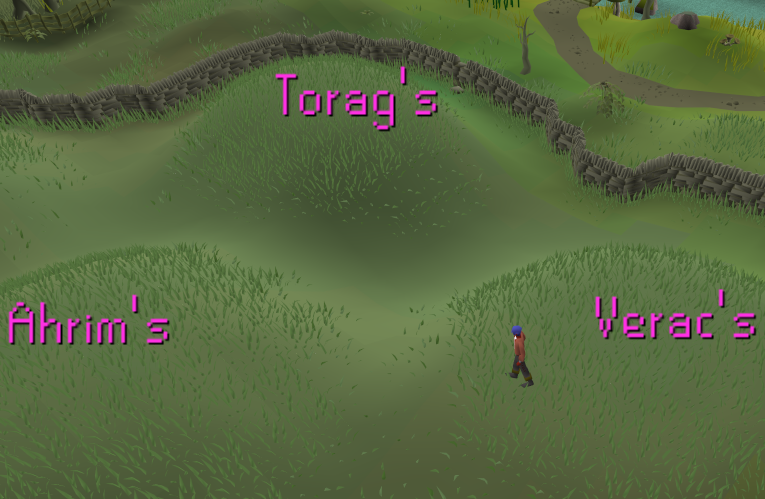

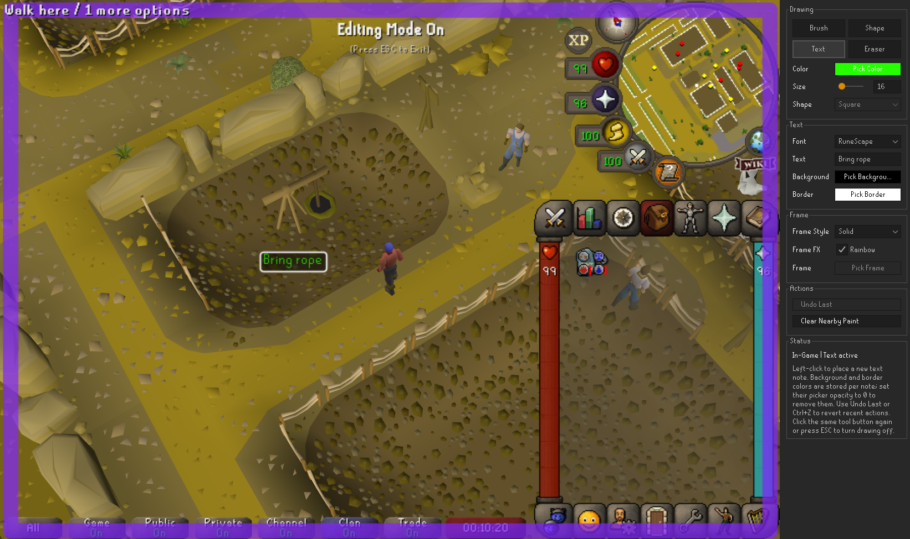

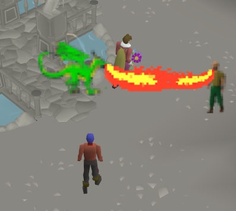

## Known Issues

- You cannot draw on elevated surfaces such as the Grand Exchange platform or the southern building in Seers.

## Support Development

If you find this plugin useful and would like to support its continued development:

- [Sponsor me on GitHub](https://github.com/sponsors/vahnx)
- [Support me through PayPal](https://paypal.me/twitchplaying)

Thank you for your support!
